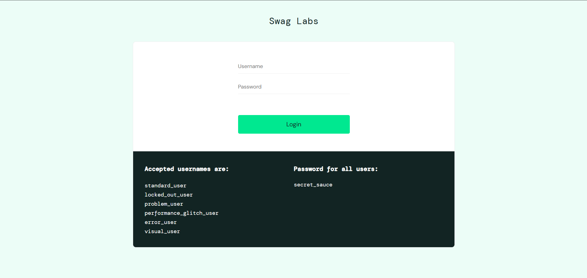
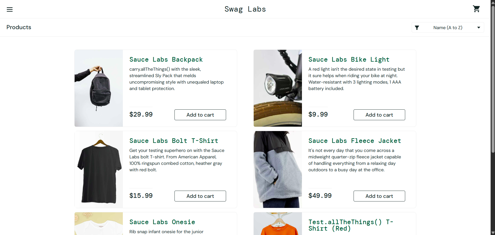
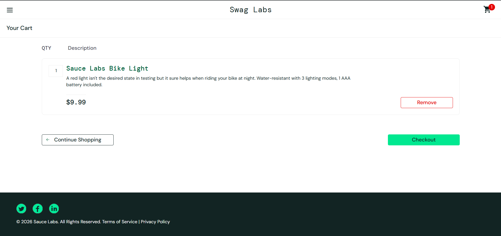

<div align="center">

# 🧪 Sauce Demo Manual Testing Project

### End-to-End Manual Testing of Sauce Demo E-Commerce Application


</div>

---

# 📌 Project Overview

This repository contains a complete **Manual Testing Project** conducted on the **Sauce Demo E-Commerce Web Application**.

The objective of this project was to validate the application's functionality, identify defects, ensure requirement coverage, and verify that the system behaves as expected from an end-user perspective.

The project includes all major QA deliverables used in a real Software Testing Life Cycle (STLC).

---

# 🎯 Testing Objectives

✅ Verify application functionality

✅ Validate user workflows

✅ Identify and document defects

✅ Ensure requirement traceability

✅ Improve product quality

✅ Simulate real-world QA activities

---

# 🌐 Application Under Test

**Application Name:** Sauce Demo

**Type:** E-Commerce Web Application

**URL:** https://www.saucedemo.com/

**Modules Covered:**

- Login
- Product Listing
- Product Details
- Cart
- Checkout
- Order Completion

---

# 🧪 Testing Scope

### In Scope

- Functional Testing
- UI Validation
- Positive Testing
- Negative Testing
- Boundary Testing
- Defect Reporting
- Requirement Traceability

### Out of Scope

- Performance Testing
- Security Testing
- Automation Testing
- Compatibility Testing

---

# 📋 QA Deliverables

| Document | Description |
|-----------|------------|
| Test Plan | Testing strategy, scope, objectives, schedule |
| Test Cases | Detailed test scenarios and execution steps |
| RTM | Requirement Traceability Matrix |
| Bug Report | Defects identified during testing |

---

# 📂 Repository Contents

```text
Sauce-Demo-Manual-Testing
│
├── Sauce_Demo_Test_Plan.docx
├── Sauce_Demo_Test-Cases.xlsx
├── Sauce_Demo_RTM.xlsx
├── Sauce_Demo_Bug_Report.xlsx
│
└── README.md
```

---

# 🔄 Testing Life Cycle Followed

```text
Requirement Analysis
        ↓
Test Planning
        ↓
Test Case Design
        ↓
Test Execution
        ↓
Bug Reporting
        ↓
Retesting
        ↓
Test Closure
```

---

# 🐞 Defect Management Process

```text
New
 ↓
Assigned
 ↓
Open
 ↓
Fixed
 ↓
Retest
 ↓
Verified
 ↓
Closed
```

---

# 📊 Test Artifacts Included

### 📄 Test Plan

Contains:

- Scope
- Objectives
- Test Strategy
- Test Environment
- Entry Criteria
- Exit Criteria
- Risk Assessment

---

### 📝 Test Cases

Includes:

- Positive Scenarios
- Negative Scenarios
- Functional Validation
- User Flow Validation

---

### 🔗 RTM (Requirement Traceability Matrix)

Provides:

- Requirement Mapping
- Test Coverage Validation
- Requirement-to-Test Case Traceability

---

### 🐞 Bug Report

Contains:

- Defect ID
- Severity
- Priority
- Steps to Reproduce
- Expected Result
- Actual Result
- Status

---

# 🛠 Skills Demonstrated

### Manual Testing

- Functional Testing
- Smoke Testing
- Sanity Testing
- Regression Testing
- Retesting

### Test Documentation

- Test Plan Creation
- Test Case Design
- RTM Preparation
- Bug Reporting

### QA Concepts

- STLC
- SDLC
- Defect Life Cycle
- Severity & Priority
- Requirement Analysis

---

# 📸 Project Screenshots

Add screenshots inside a folder named:

```text
Screenshots
```

Example:

```md
## Login Page



## Product Page



## Cart Page


```

---

# 💡 Key Learnings

- Writing professional test cases
- Preparing QA documentation
- Requirement traceability
- Identifying and reporting defects
- Understanding real-world QA workflows

---

# 👨‍💻 Author

### Rohit Chaurasia

Software Test Engineer | QA Enthusiast

🔹 Manual Testing

🔹 Selenium WebDriver

🔹 Java

🔹 TestNG

🔹 Maven

🔹 Cucumber

🔹 SQL

🔹 Postman

🔹 Git & GitHub

---

<div align="center">

### ⭐ If you found this project useful, don't forget to star the repository!

</div>
